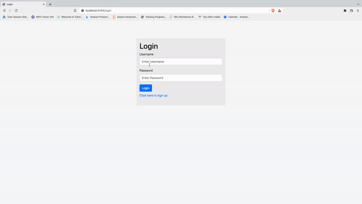

# SuperDuperDrive
A ONE-STOP record management tool that acts as a cloud service for data storage including files, notes, and login credentials for variety of websites.

## Demo <h6>For full video demo, click on the gif</h6>

## Application Services
1. Save, view, download, and delete files. [limited storage due to database capacity]
2. Save, edit, view and delete notes.
3. Save, edit, view and delete credentials.

## Security Considerations
1. Prevention against SQL injection.
2. Secured API access.
3. Prevention against cross-user data access, and modification.

## Frameworks and Libraries used:
1. Spring Boot
2. JDBC In-Memory database
3. Thymeleaf for template.
4. JUnit and Selenium for testing.

## Design pattern used:
1. Dependency Inversion Principle for preventing dependency chain issues.
2. Single Responsibility Principle by segregating business logic into principles.
3. Interface Segregation Principle for easy testing of code.

